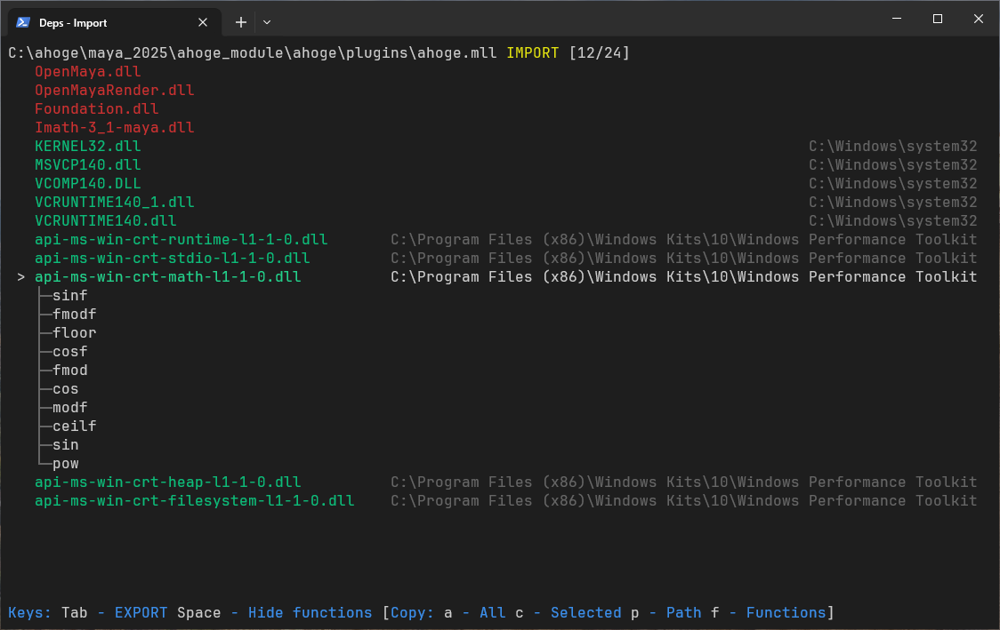

# deps

A lightweight TUI dependency walker - inspect imports, exports, and ordinal mappings of Windows PE files (EXE/DLL).

Built into [mc](https://github.com/Fiend3d/mc): highlight a file and press **F2**.

Or use it standalone:
```
Usage: deps [flags] <filepath>
  -v    print version
  -i    print imports
  -e    print exports
```

## Demo


